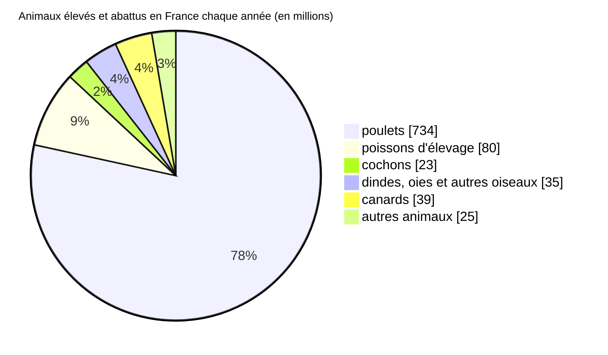

Chaque année en France nous élevons et abattons près d’un milliard d’animaux dont près de 80% de poulets et 10% de poissons. [^ourworldindata]

Les vaches, cochons, moutons et chèvres représentent à eux tous moins de 4% des animaux abattus chaque année en France. [^ourworldindata]

Parmi les autres animaux regroupés sur ce graphique, on élève et abat chaque année en France :

- 16 millions de lapins soit 2%
- 4.5 millions de vaches soit 0,4%
- 4.5 millions de moutons et chèvres soit 0,4% [^ourworldindata]

Vous trouverez ci-dessous des informations sur les conditions de plusieurs espèces exploitées en France.

[^ourworldindata]: [Our World In Data - Animal Welfare - analyses des données de la FAO](https://ourworldindata.org/explorers/animal-welfare)
