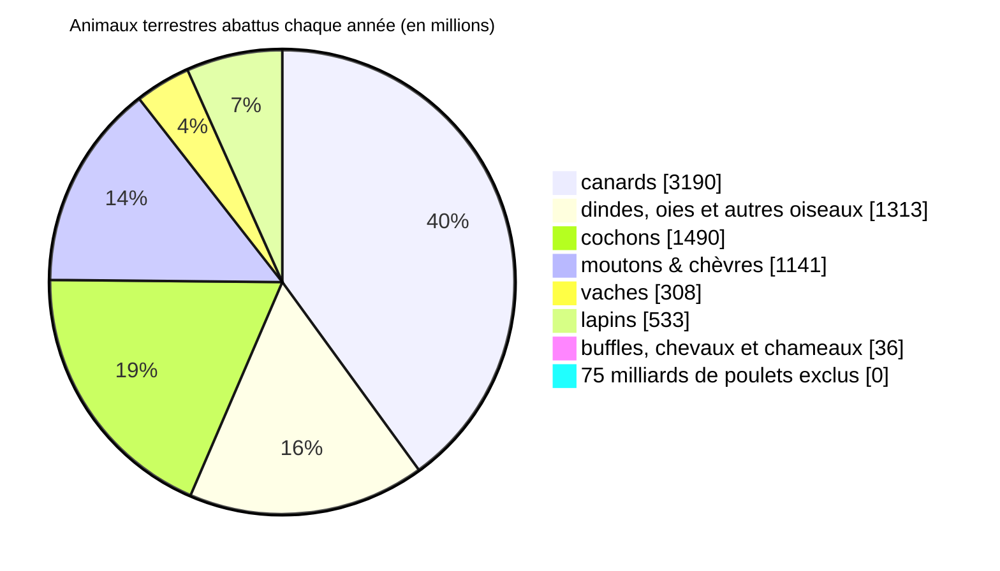

## Animaux abattus

Chaque année dans le monde, 7 milliards d’humains pêchent 1600 milliards de poissons, et abattent 83 milliards d’animaux terrestres [^1].

90% des animaux terrestres abattus sont des poulets [1].

(ces chiffres sont arrondis)

## Conditions d’exploitation

Quasiment tous les animaux élevés aujourd’hui résultent d’une longue sélection génétique optimisée pour augmenter la quantité de viande et diminuer les coûts d’élevage.
Ces animaux ont une espérance de vie nettement inférieure aux espèces sauvages et sont souvent incapables de se reproduire.

Environ 70% des animaux en France subissent un élevage intensif : aucun accès à l’extérieur et densités importantes [3].
Il s’agit de la quasi totalité des lapins, 95% et plus des cochons et dindes, 84% des poulets, 60% des chèvres et 54% des poules pondeuses [3].

Les animaux subissent énormément de stress et de peur lors de l’abattage et du transport.
Ils et elles sont fréquemment pendus par les pieds, dépecés et abattus alors qu’ils sont encore conscients.

## Détails par espèces

- [🐓 Poulets](/animaux/poulets) (90% des animaux terrestres exploités)
- [🐖 Cochons](/animaux/cochons)
- [🐔 Poules pondeuses](/animaux/poules-pondeuses)
- [🐄 Bovins](/animaux/bovins) (moins de 6% des animaux terrestres exploités en France)

sources :

[^1]: [Our World In Data - Animal Welfare - analyses des données de la FAO](https://ourworldindata.org/explorers/animal-welfare)
- [[2] - Nations Unies - Food And Agriculture Organization (FAO) - FAOSTAT database](http://www.fao.org/faostat/en/#data/QL)
- [[3] - L214 - Élevage intensif - Chiffres-clés de la souffrance animale - 2021](https://drive.google.com/file/d/1Mz6Pha4cHSIzIZ4vIIlz5z07cRQEeFKj/view)
