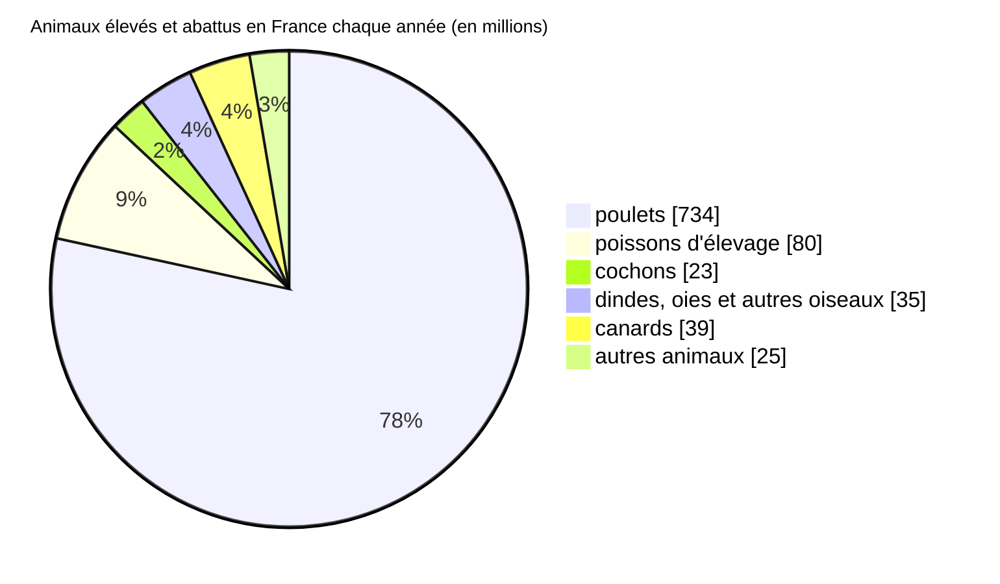

## Nombre et répartition des animaux exploités

<!-- Chaque année dans le monde, 7 milliards d’humains pêchent 1600 milliards de poissons et abattent 83 milliards d’animaux terrestres dont 90% de poulets [^ourworldindata]. -->

*Tous les chiffres ci-dessous sont arrondis*

Chaque année en France nous pêchons plus de 2 milliards de poissons sauvages, et élevons et abattons plus de 930 millions d’animaux dont près de 80% de poulets [^ourworldindata].

Parmi les autres animaux, on élève et abat chaque année en France :
- 16 millions de lapins soit 2%
- 4.5 millions de vaches soit 0,4%
- 4.5 millions de moutons et chèvres soit 0,4% [^ourworldindata]

## Conditions d’exploitation

Quasiment tous les animaux élevés aujourd’hui résultent d’une longue sélection génétique optimisée pour augmenter la quantité de viande et diminuer les coûts d’élevage.
Ces animaux ont une espérance de vie nettement inférieure aux espèces sauvages et sont souvent incapables de se reproduire.

Environ 70% des animaux en France subissent un élevage intensif, ils n’ont aucun accès à l’extérieur et ont peu d’espace [^l214souffrance]. Quasiment tous les lapins, plus de 95% des cochons et des dindes et 84% des poulets sont élevés dans ces conditions intensives.

Lors de l’abattage et du transport, les animaux subissent énormément de stress et de peur.
Les animaux sont fréquemment pendus par les pieds, dépecés et abattus alors qu’ils sont encore conscients.

<!-- Les petits élevages -->

<!-- Recherche scientifique -->

<!-- Propriétés mobilières -->
<!-- Dans le droit français, les animaux sont considérés comme des propriétés mobilières. -->

[^ourworldindata]: [Our World In Data - Animal Welfare - analyses des données de la FAO](https://ourworldindata.org/explorers/animal-welfare)
[^fao]: [Nations Unies - Food And Agriculture Organization (FAO) - FAOSTAT database](http://www.fao.org/faostat/en/#data/QL)
[^l214souffrance]: [L214 - Élevage intensif - Chiffres-clés de la souffrance animale - 2021](https://drive.google.com/file/d/1Mz6Pha4cHSIzIZ4vIIlz5z07cRQEeFKj/view)
